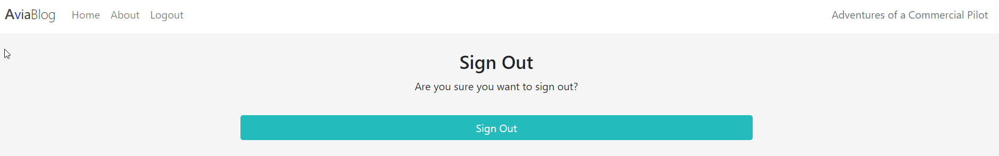

# __AviaBlog__

Welcome to the Aviablog website! This website is designed to quickly give you an overview of the most interesting articles in the world of aviation. The website has been partly written in the Python language using the Django framework.

## __Features__

In this chapter, I will go over the AviaBlog website existing features and future features that still need to be implemented. The features can be explained on the basis of the following flow chart:

### __Existing features__

- __The home screen__
  
The home screen of the website is rather simple but useful. The main purpose of the website is to give you an overview of the latest aviation news and this is being presented to you in the form of the latest 6 articles. 

A clean but simple nav bar is presented with 4 buttons. Namely the Home, About, Register and Login button. As soon as you are logged in, the layout changed to 3 buttons, namely the Home, About and Logout button.

A nice little touch is given with the website's logo in the top left corner, and the website's slogan in the top right corner of the screen, which reads: 'Adventures of a Commercial Pilot'. 

The website's footer consists of a simple menu bringing the user to the AviaBlog social media platforms. A little note has to be made that the links are currently consisting of different platforms than Aviablog because we are still in the startup phase.

The website also contains some custom made javascript located in a seperate javascript file to make all alert messages dissapear after 2.5 seconds.

On top of that did I change the media queries to make the site more responive to smaller screens.

- __The about screen__

The about screen is interesting in particular. Not only because of the interesting information that can be found here about Aviablog, but also in the way it has been coded. A standard greeting, and a little explanation of who we are and what we want is directly visible. 

Underneath, it becomes more interesting. The user can read about our story by clicking a dropdown menu. Ater clicking the dropdown menu, the story that is being shown can be easily changed by the admin of the website by simply going to the admin environment and clicking on the abouts tap. Because the world of aviation is changing so fast, we decided to make the story about us adjustable very easily.

- __The register screen__

The register screen is rather simple as well. The user is being asked to provide us with a username of their choice, optionally their email address, their password, and a confirmation of their password. The user is also reminded that in case they are already signed up with us, they have to click the sign in link instead. The model of this screen has been written by code institute but the layout has been modified in CSS by me.

  

- __The login screen__

The login screen also reminds the user of registering first if this has not been done before. In case the user has already been registered, it's easy to gain access by filling in the username and password. A handy remind me checkbox has been added as well. This part of the website has also been written by code institute. Again, the layout has been modified to meet the AviaBlog standards. 

After logging in, an alert message will appear for 2.5 seconds letting the user know the login has been successful.

  

- __The logout screen__

The logout screen only consists of a question if the user is sure he or she wants to logout? If this is the case, a big green sign out bar have to be clicked. 

  

### __Features left to implement__

In this chapter, I will describe some of the features that are not implemented at this moment, but will possibly be implemented in the future. 

  - A 'forgot my password' option on the login screen.
  - An extra nav option called 'categories', where the user can search articles in certain different categories.
  - Video support for a vlogging divison of AviaBlog.

## __Testing__

The application have both been fully tested inside the gitpod environment as well as in the heroku environment. No unexpected behavior have been encountered. No error messages have been raised.

### __Unfixed bugs__

 The application has no serious bugs. However, the code could use some tidying up in the future. The reason is a lack of time to make it to the deadline of submitting the project.

## __Deployment__
- The site was deployed to Heroku. The steps to deploy are as follows:
  - Created an account using my personal email address (johanvanerkel@gmail.com) and selected 'create new app' from the home screen.
  - Chose the following app name: portfolio-4-blog and selected 'Europe' as region.
  - Selected the right settings as explained in walk through project videos.
  - Deployed project by connecting my heroky account to my github account (same email address used for github)
  - Heroku generated a web address to visit the web application which I will state here:
    https://portfolio-4-blog.herokuapp.com/

## __Credits__

The idea to keep my project simple came from my mentor. She said it's a good option to make use of the 'I think therefore I blog' walkthrough project as some sort of a basis for my own project. Since my lack of time, I think this has been a wise choice. I learned a lot about coding during this project and I'm starting to see how a django powered project falls on it's place. There's a lot more work to do though! I therefore really hope I pass this project, so I can look forward to the next part of the course.

For research and support, I also used the following websites:
- https://www.w3schools.com/ (used to gather information)
- https://developer.mozilla.org/ (used to gather information) 
- https://stackoverflow.com/ (forum for asking questions)

I also got information from Youtube. My favorite used youtube channels are as follows:
- Programming with Mosh
- Web Dev Simplified
- freeCodeCamp.org

## __Epilogue__

Thank you for taking the time to read through this README, my code and of course the end result of the Aviablog website. I hope you find the end result inspiring as well!

